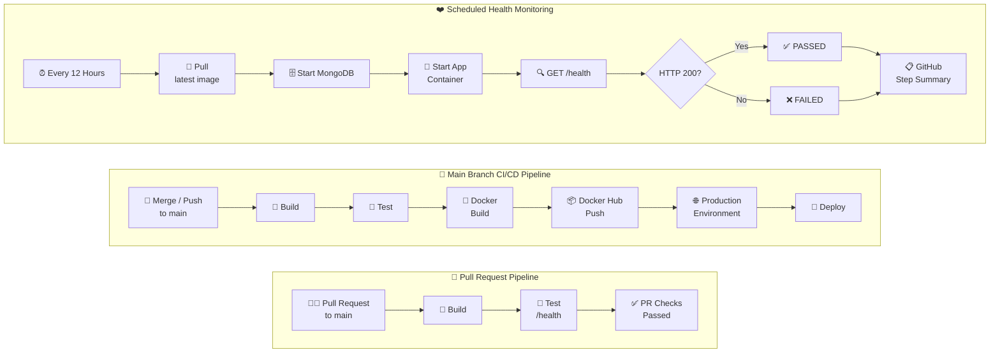

# GitHub Actions CI/CD Capstone


[](https://github.com/Jaishree97/github-actions-capstone/actions/workflows/04-main-pipeline.yml) [](https://github.com/Jaishree97/github-actions-capstone/actions/workflows/03-pr-pipeline.yml) [](https://github.com/Jaishree97/github-actions-capstone/actions/workflows/05-health-check.yml) 

A hands-on GitHub Actions CI/CD project built using my Dockerized Task Manager application.

This project demonstrates an end-to-end CI/CD workflow including:

- Automated build and testing
- Reusable GitHub Actions workflows
- Pull request validation
- Docker image build and push
- Production deployment workflow
- Scheduled application health checks
- Docker image vulnerability scanning

## Application

The project uses a Node.js and Express Task Manager application with MongoDB.

### Health Endpoint

```text
GET /health
```

## PR Validation

Pull requests to `main` are automatically validated using the reusable build and test workflow.


## 🏗️ CI/CD Pipeline Architecture

