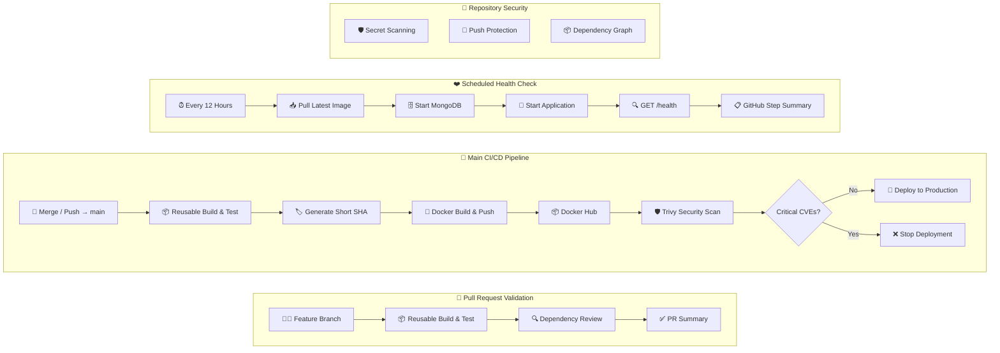

# GitHub Actions CI/CD Capstone


[](https://github.com/Jaishree97/github-actions-capstone/actions/workflows/04-main-pipeline.yml) [](https://github.com/Jaishree97/github-actions-capstone/actions/workflows/03-pr-pipeline.yml) [](https://github.com/Jaishree97/github-actions-capstone/actions/workflows/05-health-check.yml) 

A hands-on GitHub Actions CI/CD project built using my Dockerized Task Manager application.

This project demonstrates an end-to-end CI/CD workflow including:

- Automated build and testing
- Reusable GitHub Actions workflows
- Pull request validation
- Docker image build and push
- Production deployment workflow
- Scheduled application health checks
- Docker image vulnerability scanning

## ✨ Features

- Reusable GitHub Actions workflows using `workflow_call`
- Automated Build & Test pipeline
- Docker image build and push to Docker Hub
- Automatic image versioning using Git commit SHA
- Trivy container image vulnerability scanning
- GitHub Dependency Review on Pull Requests
- Secret Scanning & Push Protection
- SARIF upload to GitHub Code Scanning
- Dependabot automated dependency updates
- Least-Privilege GitHub Actions permissions
- Scheduled application health checks
- Production deployment workflow

---

## 🏗️ DevSecOps Pipeline Architecture


---

## ⚙️ Workflow Overview

This project uses multiple GitHub Actions workflows to implement a production-style CI/CD and DevSecOps pipeline.

| Workflow | Trigger | Purpose |
|----------|---------|---------|
| [`01-reusable-build-test.yml`](./.github/workflows/01-reusable-build-test.yml) | `workflow_call` | Reusable workflow to install dependencies, build the application, and run tests. |
| [`02-reusable-docker.yml`](./.github/workflows/02-reusable-docker.yml) | `workflow_call` | Builds the Docker image and pushes it to Docker Hub. |
| [`03-pr-pipeline.yml`](./.github/workflows/03-pr-pipeline.yml) | `pull_request` | Validates Pull Requests before merging. |
| [`04-main-pipeline.yml`](.github/workflows/04-main-pipeline.yml) | `push` to `main` | Executes the complete CI/CD and DevSecOps pipeline. |
| [`05-health-check.yml`](./.github/workflows/05-health-check.yml) | `schedule` | Performs periodic health checks. |
| [`dependabot.yml`](./.github/dependabot.yml) | `schedule` | Automatically creates dependency update PRs. |

---

### 🔄 Pull Request Workflow

```text
Pull Request
      │
      ▼
Build & Test
      │
      ▼
Dependency Review
      │
      ▼
PR Validation ✅
```

---

### 🚀 Main Branch Workflow

```text
Push to main
      │
      ▼
Build & Test
      │
      ▼
Generate Commit SHA
      │
      ▼
Docker Build & Push
      │
      ▼
Trivy Security Scan
      │
      ▼
Deploy to Production
```

---

### ❤️ Scheduled Health Check

```text
Every 12 Hours
      │
      ▼
Pull Latest Docker Image
      │
      ▼
Start MongoDB
      │
      ▼
Run Application
      │
      ▼
Health Check (/health)
      │
      ▼
GitHub Step Summary
```

---

### 🔐 Continuous Security

```text
Dependabot
      │
      ▼
Dependency Updates

Secret Scanning
      │
      ▼
Detect Exposed Secrets

Code Scanning (SARIF)
      │
      ▼
GitHub Security Dashboard
```