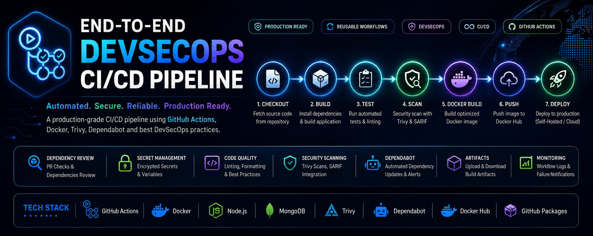
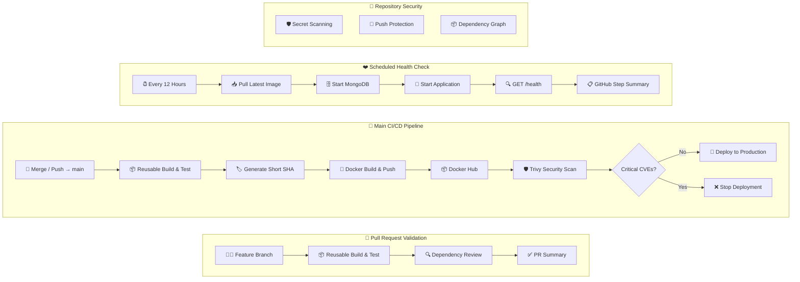
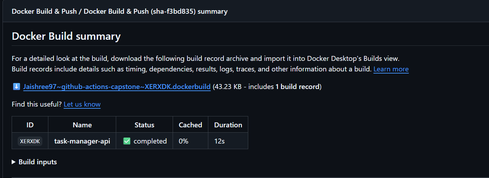
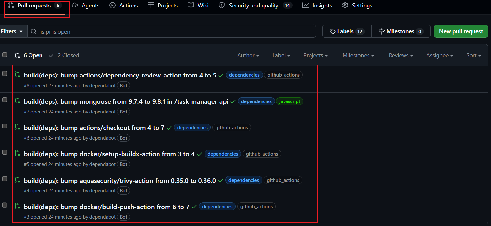

# 🚀 End-to-End DevSecOps CI/CD Pipeline with GitHub Actions

<p align="center">
  
</p>

<p align="center">
  <a href="https://github.com/Jaishree97/github-actions-capstone/actions/workflows/04-main-pipeline.yml">
    
  </a>
  <a href="https://github.com/Jaishree97/github-actions-capstone/actions/workflows/03-pr-pipeline.yml">
    
  </a>
  <a href="https://github.com/Jaishree97/github-actions-capstone/actions/workflows/05-health-check.yml">
    
  </a>
  
</p>

<p align="center">
  
  
  
</p>

---

## 📌 Project Overview

This repository demonstrates a production-style CI/CD and DevSecOps pipeline built with GitHub Actions for a Dockerized Node.js Task Manager API.

The pipeline automates every stage of the software delivery lifecycle—from pull request validation and testing to Docker image creation, vulnerability scanning, deployment, and scheduled health monitoring.

The objective of this project is to demonstrate a production-style GitHub Actions DevSecOps pipeline using reusable workflows, automated testing, container security scanning, Docker image publishing, deployment automation, and scheduled health monitoring.

---

## 📑 Table of Contents

- [📌 Project Overview](#-project-overview)
- [⭐ Key Features](#-key-features)
- [🎯 Project Goal](#-project-goal)
- [🏗️ DevSecOps Pipeline Architecture](#️-devsecops-pipeline-architecture)
- [🛠️ Tech Stack](#️-tech-stack)
- [✨ Pipeline Capabilities](#-pipeline-capabilities)
- [⚙️ Workflow Overview](#️-workflow-overview)
- [📸 Pipeline Preview](#-pipeline-preview)
- [🚀 Quick Start](#-quick-start)
- [📂 Project Structure](#-project-structure)
- [📖 Repository Documentation](#-repository-documentation)
- [🔐 DevSecOps Security Controls](#-devsecops-security-controls)
- [🎯 Project Highlights](#-project-highlights)
- [🚀 Future Improvements](#-future-improvements)

---

## ⭐ Key Features

| Feature | Description |
|----------|-------------|
| 🔁 Reusable Workflows | Modular GitHub Actions using `workflow_call` |
| 🧪 Automated Testing | Run tests before every deployment |
| 🐳 Docker Build & Push | Publish versioned images to Docker Hub |
| 🛡️ Trivy Security Scan | Scan container images for vulnerabilities |
| 🔍 Dependency Review | Detect vulnerable dependencies in Pull Requests |
| 📦 Dependabot | Automatic dependency updates |
| 🔐 Secret Scanning | Detect leaked credentials |
| 📄 SARIF Upload | Publish scan results to GitHub Security |
| 🚀 Production Deployment | Deploy only after all security gates pass |
| ❤️ Health Monitoring | Scheduled application health checks |

---

## 🎯 Project Goal

The objective of this project is to demonstrate how a Dockerized application can be delivered through a production-style GitHub Actions DevSecOps pipeline by integrating reusable workflows, automated testing, security scanning, Docker image publishing, deployment, and continuous health monitoring.

---

## 🏗️ DevSecOps Pipeline Architecture


---

## 🛠️ Tech Stack

| Category | Technologies |
|-----------|--------------|
| Language | JavaScript (Node.js) |
| Framework | Express.js |
| Database | MongoDB |
| Containerization | Docker |
| CI/CD | GitHub Actions |
| Security | Trivy, Dependency Review, Dependabot, Secret Scanning, GitHub Code Scanning |
| Registry | Docker Hub |
| Automation | GitHub Actions Reusable Workflows |

---

## ✨ Pipeline Capabilities

- ✅ Pull Request Validation
- ✅ Automated Build & Test
- ✅ Docker Image Build & Push
- ✅ Security Scanning with Trivy
- ✅ Dependency Review
- ✅ GitHub Code Scanning
- ✅ Secret Scanning
- ✅ Dependabot Integration
- ✅ Scheduled Health Checks
- ✅ Production Deployment

---

## ⚙️ Workflow Overview

This project uses multiple GitHub Actions workflows to implement a production-style CI/CD and DevSecOps pipeline.

| Workflow | Trigger | Purpose |
|----------|---------|---------|
| [`01-reusable-build-test.yml`](./.github/workflows/01-reusable-build-test.yml) | `workflow_call` | Reusable workflow to install dependencies, build the application, and run tests. |
| [`02-reusable-docker.yml`](./.github/workflows/02-reusable-docker.yml) | `workflow_call` | Builds the Docker image and pushes it to Docker Hub. |
| [`03-pr-pipeline.yml`](./.github/workflows/03-pr-pipeline.yml) | `pull_request` | Validates Pull Requests before merging. |
| [`04-main-pipeline.yml`](./.github/workflows/04-main-pipeline.yml) | `push` to `main` | Executes the complete CI/CD and DevSecOps pipeline. |
| [`05-health-check.yml`](./.github/workflows/05-health-check.yml) | `schedule` | Performs periodic health checks. |
| [`dependabot.yml`](./.github/dependabot.yml) | `schedule` | Automatically creates dependency update PRs. |

---

## 📸 Pipeline Preview

Below are screenshots from real GitHub Actions workflow runs demonstrating the complete CI/CD and DevSecOps pipeline.

> 📁 Additional screenshots and workflow outputs are available in the [`images/`](./images) directory.

### 🚀 Main CI/CD Pipeline
The complete production workflow showing Build & Test, Docker Build & Push, Trivy Security Scan, and Deployment.


---

### 🔀 Pull Request Validation Pipeline
Every Pull Request is automatically validated by running build, tests, and dependency review before it can be merged.


---

### 🐳 Docker Build & Push
Builds the Docker image, tags it using the Git commit SHA, and publishes it to Docker Hub.



---

### 🛡️ Trivy Security Scan
Trivy scans the Docker image for vulnerabilities. The pipeline blocks deployment if critical vulnerabilities are detected.


---

### 🔍 GitHub Security Dashboard
Security scan results are uploaded using SARIF and displayed in GitHub Code Scanning for centralized vulnerability management.


---

### 🤖 Dependabot Pull Requests
Dependabot automatically creates Pull Requests to keep GitHub Actions and project dependencies secure and up to date.



---

### ❤️ Scheduled Health Check
A scheduled workflow periodically pulls the latest Docker image, starts the application, and verifies the `/health` endpoint to ensure the deployment remains healthy.


---

## 🚀 Quick Start

Clone the repository and start the application locally.

```bash
git clone https://github.com/Jaishree97/github-actions-capstone.git

cd github-actions-capstone/task-manager-api

docker compose up --build -d
```
The application will be available at:

```text
http://localhost:3000
```

For detailed setup instructions, Docker usage, environment configuration, and API documentation, see:

📘 **[`task-manager-api/README.md`](./task-manager-api/README.md)**

---

## 📂 Project Structure

> **Repository organization:** The CI/CD pipeline and application source code are intentionally separated to keep the workflows modular, maintainable, and production-ready.

```text
github-actions-capstone/
├── .github/
│   ├── dependabot.yml                       # Dependabot configuration
│   └── workflows/
│       ├── 01-reusable-build-test.yml       # Reusable build & test workflow
│       ├── 02-reusable-docker.yml           # Reusable Docker build & push workflow
│       ├── 03-pr-pipeline.yml               # Pull Request validation pipeline
│       ├── 04-main-pipeline.yml             # Main DevSecOps CI/CD pipeline
│       └── 05-health-check.yml              # Scheduled health monitoring
│
├── assets/
│   └── github-actions-capstone-banner.png   # Project banner
│
├── images/                                  # README screenshots
│
├── task-manager-api/
│   ├── models/
│   ├── public/
│   ├── routes/
│   ├── tests/
│   ├── views/
│   ├── Dockerfile
│   ├── docker-compose.yml
│   ├── package.json
│   ├── package-lock.json
│   ├── server.js
│   └── README.md                            # Application setup, Docker guide, API documentation & local development
│
├── .gitignore
└── README.md                                # DevSecOps pipeline documentation
```
---

## 📖 Repository Documentation

This repository contains two separate documentation guides.

| Documentation | Purpose |
|---------------|---------|
| 📘 **Root README.md** | Complete documentation of the GitHub Actions CI/CD pipeline, DevSecOps architecture, reusable workflows, security integrations, deployment flow, and pipeline previews. |
| 🚀 **task-manager-api/README.md** | Step-by-step guide for running the application locally, Docker setup, Docker Compose usage, environment configuration, API documentation, and development workflow. |

> 💡 **Recommended reading order**
>
> 1. Read this README to understand the DevSecOps pipeline.
> 2. Open `task-manager-api/README.md` to run the application locally.

---

## 🔐 DevSecOps Security Controls

| Security Layer | Purpose |
|----------------|---------|
| 🛡️ Trivy | Container vulnerability scanning |
| 📄 SARIF | Upload scan results to GitHub Security |
| 🔍 Dependency Review | Detect vulnerable packages in PRs |
| 🤖 Dependabot | Automated dependency updates |
| 🔐 Secret Scanning | Detect exposed credentials |
| 🚫 Push Protection | Prevent accidental secret commits |
| 🔒 Least Privilege | Restrict workflow permissions |

---

## 🎯 Project Highlights

- ✅ Designed reusable GitHub Actions workflows using `workflow_call`
- ✅ Built a production-style CI/CD pipeline
- ✅ Automated Docker image build and publishing
- ✅ Implemented DevSecOps best practices
- ✅ Integrated Trivy vulnerability scanning
- ✅ Published SARIF reports to GitHub Code Scanning
- ✅ Configured Dependabot and Dependency Review
- ✅ Applied least-privilege workflow permissions
- ✅ Automated scheduled application health checks

---

## 🚀 Future Improvements

- AWS ECS / EKS deployment
- Terraform infrastructure provisioning
- OIDC authentication for GitHub Actions
- Slack or Microsoft Teams notifications
- Semantic versioning & automated releases
- Infrastructure as Code testing

---

## 👩‍💻 Connect With Me

- 💼 **LinkedIn:** <https://www.linkedin.com/in/jaishree-chaure>
- 💻 **GitHub:** <https://github.com/Jaishree97>

---

## ⭐ Support

If you found this project useful, consider giving it a ⭐.

Issues, suggestions, and pull requests are always welcome.